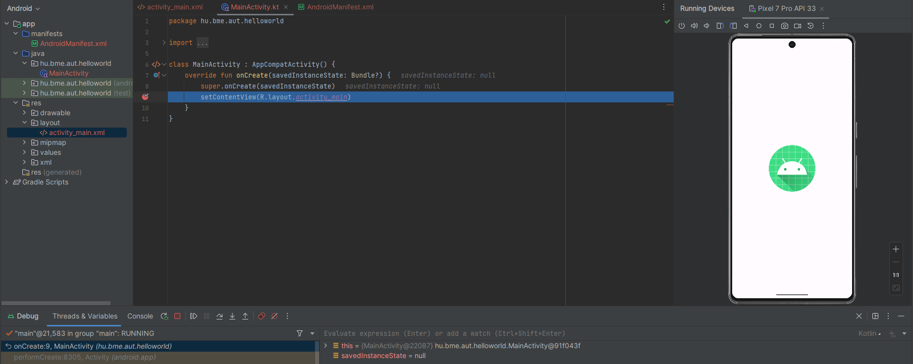
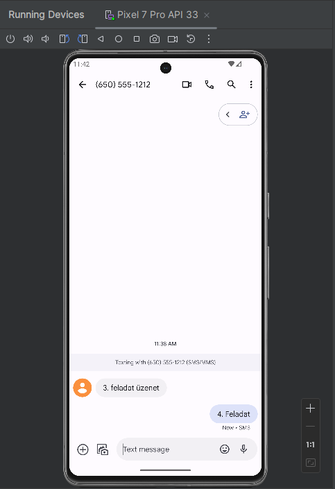
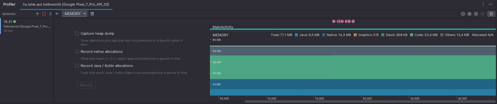

# Android01 labor - HelloWorld

## Feladat 1

Magyarázat: Rá kellett nyomni a 'Run' gombra, a build után az alkalmazás feltelepült az emulátorra és el is indult.

## Feladat 2

Magyarázat: Rá kellett kattintani az adott sorra ahová el szeretnénk helyezni a breakpointot majd Debug módban futtatva a kódot meg is áll az alkalmazás az adott ponton.

## Feladat 3

Magyarázat: Az extended controlson belül a phone menüpontnál tudunk hívást (fetni kép) és sms-t is küldeni (lenti kép)

## Feladat 4

Magyarázat: A telefonról indítottam hívást melyet fogadott a rendszer, 1. kép. Majd sms-t is küldtem, 2.kép.

## Feladat 5

Magyarázat: A labort követően otthon is leteszteltem a funkciót.

## Feladat 6

Magyarázat: Az extended controls-nál a Location menüpontban tudtam változtatni a "telefon" virtuális helyzetét, mely látszik is a térképen.

## Feladat 7

Magyarázat: Az Android profilernél a CPU-ra kattintva megtekinthető az összes nyitott szál (1. kép), valamint a használt memória is (2. kép).

## Feladat 8

Magyarázat: A képen látható a Logcat tartalma.

## Feladat 9

Magyarázat: A képen látható az Inspect code eredménye.

## Feladat 10

Magyarázat: A képen látható, hogy a .apk fájl merre található és, hogy mi található benne.
